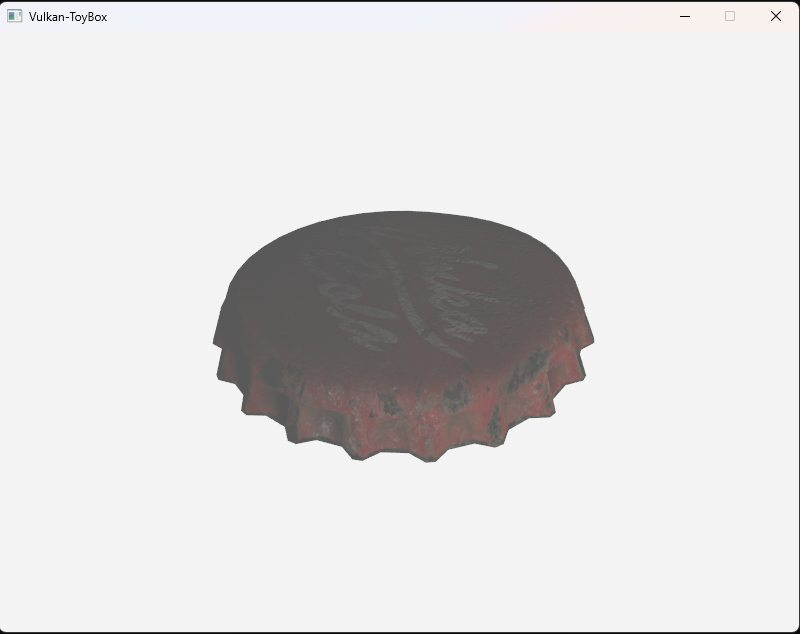

# Hi! I'm Alex. 👋

🎓 Master's student at the University of Waterloo, graduated Dec 2024.

💻 Graphics programmer focused on real-time rendering, coding with C++, OpenGL, and Vulkan API.

🌟 Passionate about optimizing rendering pipelines and creating immersive visuals.

🌍 Fluent in English, Native in Mandarin.

## Projects

<table>
  <tr>
    <th><strong>Graphics API</strong></th>
    <th><strong>Others</strong></th>
  </tr>
  <tr>
    <td style="text-align: center;">
      
       
      <b><a href="https://github.com/ZzzhHe/ZzRenderer">ZzRenderer</a></b>
      
OpenGL PRB Renderer

    </td>
    <td style="text-align: center;">
      
       
      <b><a href="https://github.com/Simple-XX/SimpleRenderer/tree/main">SimpleRenderer</a></b>
      
Multi-thread Real-time Software Rasterization

    </td>
  </tr>
  <tr>
    <td style="text-align: center;">
      
       
      <b><a href="https://github.com/ZzzhHe/Vulkan-Toybox">Vulkan-Toybox</a></b>
      
Vulkan Rendering Framework

    </td>
    <td style="text-align: center;">
      
       
      <b><a href="https://github.com/ZzzhHe/VulkEngine">VulkEngine</a></b>
      
Vulkan Simple Renderer

    </td>
  </tr>
  <tr>
    <td style="text-align: center;">
      
       
      <b><a href="https://github.com/ZzzhHe/Grass-Rendering">Grass-Rendering</a></b>
      
Simulate the grass effect of Ghost of Tsushima

    </td>
    <td style="text-align: center;">
      
       
      <b><a href="https://github.com/ZzzhHe/SolarSystem">Solar Eclipse</a></b>
OpenGL: Exploring Solar System

    </td>
  </tr>
</table>

## Contact

- **🎮 Discord:** @alexzhhe
- **🖼️ Grallery:** 🚧 WIP

  <a href="https://github.com/ZzzhHe">
    <picture>
      <source media="(prefers-color-scheme: dark)" srcset="https://cdn.simpleicons.org/github/white">
      </picture></a>
  

---

  <b>Visitors count</b> 
  

